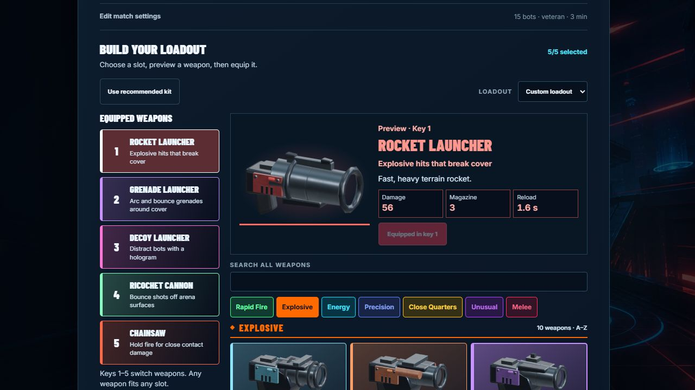

# Master Blaster community post drafts

The latest [General feedback post on the editable Page](https://chatgpt.com/space/page_6f014dc1bbfc81919de2edf967cf18bf) is the default for all future outreach emails and posts, authorized by the user on 5 October 2026. Read it before preparing outreach. This file is a snapshot; Page and file edits do not sync automatically.

Adapt greetings, recipient references, subject/title, length, community format and source tags as needed while preserving the user's story and feedback request. The supplied father-and-son story is authorized; do not add names, account-derived details or additional creator information. The older Codex draft was removed from the Page and is no longer a separate default. Existing publication, moderation, human-verification and manual-posting constraints still apply.

## General feedback post

**Title:** Master Blaster — free browser arena shooter with grappling and destructible towers

My son who’s 8 years old is working on Master Blaster, a free browser arena shooter where you can grapple/swing across the map, blast players and the environment of towers using any of the 47 available weapons. He’s building it with AI-assisted coding and my job as his dad has been to help him set up the needed accounts and to help him with marketing :)

Please check the game out, you can do Quick Play or Training against up to 15 bots, invite friends to a Private Room, or find/create a game in Global Multiplayer. No downloads and no chats make the game child friendly.

**Play:** [Play Master Blaster](https://masterblaster.se/?ref=community&utm_source=community&utm_medium=community&utm_campaign=first_players&utm_content=showcase)

**Controls and game modes:** [How to play](https://masterblaster.se/how-to-play/?ref=community&utm_source=community&utm_medium=community&utm_campaign=first_players&utm_content=guide)

We'd love feedback, especially on:

- Does the game mechanics feel right?

- Is the game fun?

- What would you change first to make you want to play more matches?

If something breaks or runs poorly, please let us know.

Thanks for giving it a go!

## Screenshots

### Rocket action with 15 bots

Rocket Launcher equipped in a staged 15-bot engine scene with real bot combat and explosions.

[Download action-rockets.png](https://masterblaster.se/press/action-rockets.png)

### Grenade action from the player camera

Grenade Launcher equipped, captured from the player camera in a staged 15-bot engine scene.

[Download action-grenades.png](https://masterblaster.se/press/action-grenades.png)

### Home menu

Master Blaster home menu.

[Download home-menu.jpg](https://masterblaster.se/press/home-menu.jpg)

### Quick Play with 15 bots

Quick Play setup with 15 veteran bots, five equipped weapons and the current weapon preview.

[Download updated Quick Play screenshot](https://masterblaster.se/press/quick-play-loadout-2026-10-05.jpg)

The latest Quick Play image was exported unchanged from the user's native Page attachment on 5 October 2026 (SHA-256 2a981e0141f9335b9956fb740fdc277d747070f49eaa12c64b65d4c1c14294c3). Its public link is usable after Cloudflare deploys the related main commit; verify before attaching. The earlier screenshot remains for historical posts. Keep staged 15-bot scene captions with action images.
