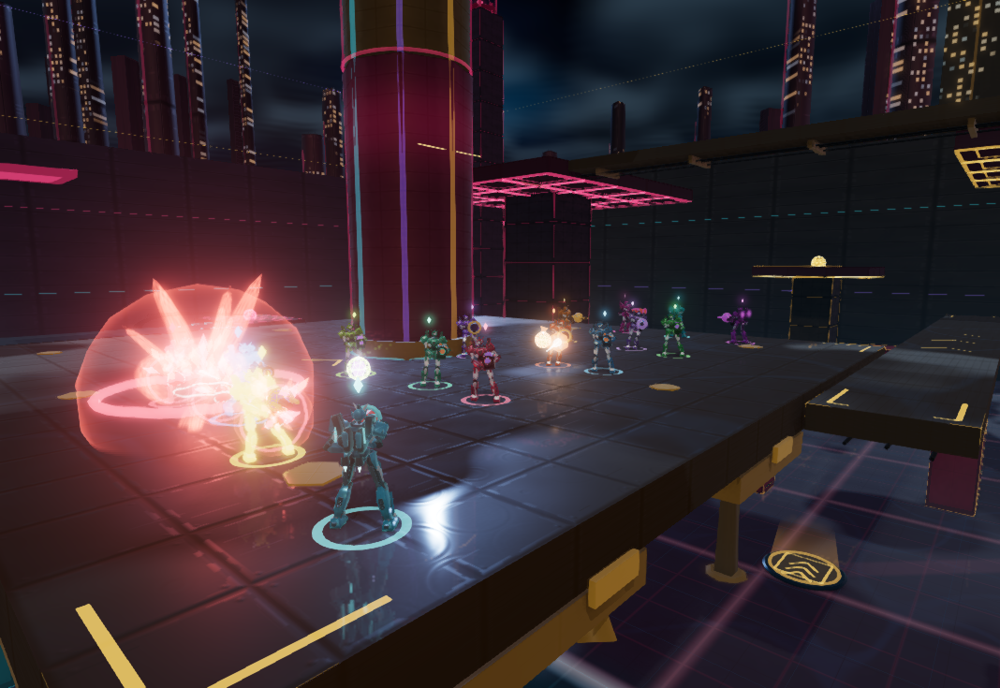
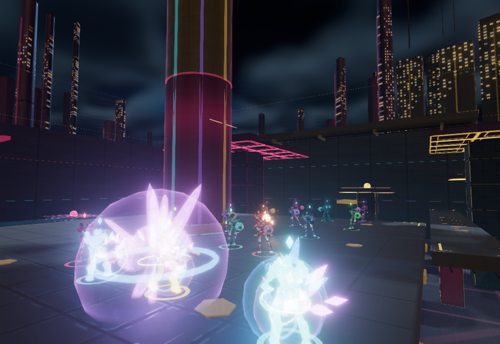
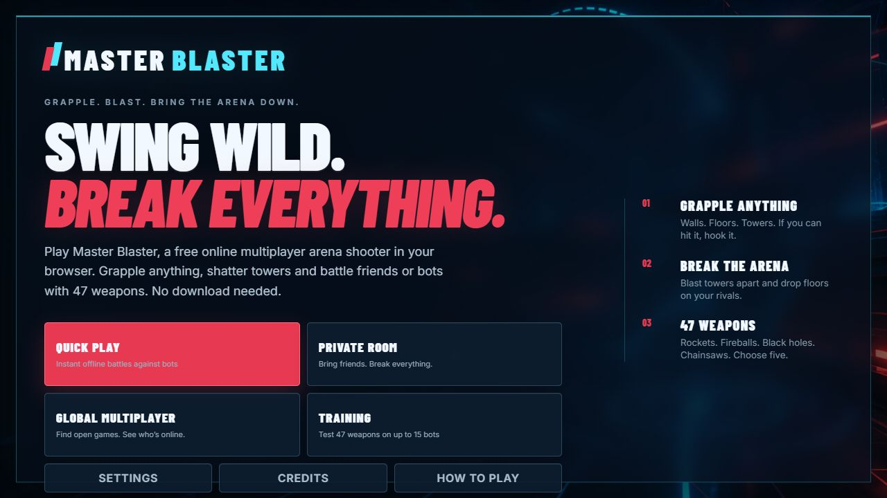
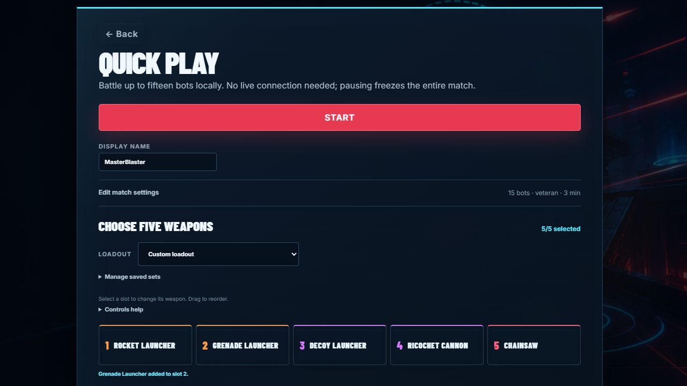

# Master Blaster community post drafts

Edit the collaborative [Page in Spaces](https://chatgpt.com/space/page_6f014dc1bbfc81919de2edf967cf18bf). This Markdown file is a snapshot from 5 October 2026; changes to the Page and this file do not sync automatically. Read the latest Page before revising or preparing publication.

## General feedback post

**Title:** Master Blaster — free browser arena shooter with grappling and destructible towers

I'm working on Master Blaster, a free browser arena shooter where you can grapple across the map, blast towers apart and choose a five-weapon loadout from 47 weapons. It's being built with AI-assisted coding.

Try Quick Play or Training against up to 15 bots, invite friends through a Private Room, or find/create a game in Global Multiplayer. No download is needed.

**Play:** [Play Master Blaster](https://masterblaster.se/?ref=community&utm_source=community&utm_medium=community&utm_campaign=first_players&utm_content=showcase)

**Controls and game modes:** [How to play](https://masterblaster.se/how-to-play/?ref=community&utm_source=community&utm_medium=community&utm_campaign=first_players&utm_content=guide)

I'd love feedback, especially on:

- Does the grappling hook feel intuitive, and can you build up speed comfortably?
- Are opponents, weapon effects and destructible cover easy to read during a fight?
- What would you change first to make you want another match?

If something breaks or runs poorly, please include your device and browser, what happened, and which game mode you tried. Thanks for giving it a go!

The two action shots use staged starting positions and loadouts in 15-bot engine scenes, with real bot combat and explosions. The menu shots show the home menu and Quick Play setup with 15 veteran bots.

## Screenshots

### Rocket action with 15 bots

Rocket Launcher equipped in a staged 15-bot engine scene with real bot combat and explosions.

[Download action-rockets.png](https://masterblaster.se/press/action-rockets.png)

### Grenade action from the player camera

Grenade Launcher equipped, captured from the player camera in a staged 15-bot engine scene.

[Download action-grenades.png](https://masterblaster.se/press/action-grenades.png)

### Home menu

Master Blaster home menu.

[Download home-menu.jpg](https://masterblaster.se/press/home-menu.jpg)

### Quick Play with 15 bots

Quick Play setup with 15 veteran bots and a five-weapon loadout.

[Download quick-play.jpg](https://masterblaster.se/press/quick-play.jpg)

## Codex showcase post

I'm working on **Master Blaster**, a free browser arena shooter built with AI-assisted coding using Three.js/WebGL. You can grapple across the map, blast towers apart and pick a five-weapon loadout from 47 weapons.

Recent Codex work included separating the first menu paint from the engine boot, checking heading-font readiness before engine import, and validating the production build and deployed assets. It also helped prepare the captures below using the game's real bot combat and explosions. The useful lesson has been to check the rendered game and live files as well as the code: a passing build alone doesn't tell you whether startup looks right or a screenshot matches its claim.

Try Quick Play or Training against up to 15 bots, invite friends through a Private Room, or find/create a game in Global Multiplayer. No download is needed.

[Play Master Blaster — free in your browser](https://masterblaster.se/?ref=codex&utm_source=codex&utm_medium=community&utm_campaign=first_players&utm_content=showcase)

[Controls and game modes](https://masterblaster.se/how-to-play/?ref=codex&utm_source=codex&utm_medium=community&utm_campaign=first_players&utm_content=guide)

I'd love feedback, especially on:

- Does the grappling hook feel intuitive, and can you build up speed comfortably?
- Are opponents, weapon effects and destructible cover easy to read during a fight?
- What would you change first to make you want another match?

If something breaks or runs poorly, please include your device and browser, what happened, and which game mode you tried. Feedback on browser-game testing workflows with Codex would also be useful.

The two action shots use staged starting positions/loadouts in 15-bot engine scenes, with real bot combat and explosions. The menu shots show the home menu and Quick Play setup with 15 veteran bots.

Thanks for giving it a go!

## Review and revisions

Edit the wording, captions and image order directly on this Page. Use comments for suggestions or questions. When your changes are saved, tell me to read this Page and revise it.

Before publication, replace `community` in both `ref` and `utm_source` with the destination. Where referral tags are prohibited, use [the canonical game link](https://masterblaster.se/) and [the canonical guide link](https://masterblaster.se/how-to-play/). Keep image URLs unchanged.

The Codex version is for manual brand-account posting under its no-bots rule. Reddit promotion remains paused while the existing removals are unresolved. Changes here do not edit already published posts.

- [ ] Revise the opening and title
- [ ] Choose the images and their order
- [ ] Add comments for the next revision
- [ ] Select the destination and adapt its links

